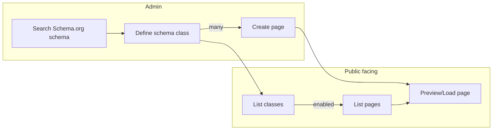

# Schema and page creation

## Schema and page creation flow

## Schema and page data mapping

- **Schema**: the blueprint for a page type
    -*identifier*: TODO
    -*secondary identifier*: TODO
- **Schema properties**: the blueprint for page fields
- **Page**: data of a specific page

### Schema

`schema_meta` SQL table:
- id: table row identifier
- name: Schema.org name of the schema e.g. BlogPosting
- identifier: name of the property selected as identifier
- secondary_identifier: name of the property selected as secondary identifier

`schema.SchemaMeta` domain:
- Name: mapped from `schema_meta.name` DB column
- Identifier: mapped from `schema_meta.identifier` DB column
- SecondaryIdentifier: mapped from `schema_meta.secondary_identifer` DB column
- Properties: mapped from `schema_meta_properties` DB table

`adminschema.schemaDto` DTO:
- IsLoaded: TODO
- Name: mapped from `SchemaMeta.Name` domain field
- Description: description of the Schema.org field
- CanonicalURL: TODO
- Properties: mapped from `SchemaMeta.Properties` domain field
- Identifier: TODO
- SecondaryIdentifier: TODO

### Schema properties

`schema_meta_properties` SQL table:
- schema_name: Schema.org name of the schema
- name: Schema.org name of the property
- mandatory: page field will be mandatory
- searchable: page field will be searchable and mapped to search columns (col0..col4)
- listable: the page property will be used on the listing pages
- type: Schema.org type what can be a complex type
- component: name of the HTML component used for representation
- order: order of the property

`schema.Property` domain:
- Name: mapped from `schema_meta_properties.schema_name` DB column
- Mandatory: mapped from `schema_meta_properties.mandatory` DB column
- Searchable: mapped from `schema_meta_properties.searchable` DB column
- Listable: mapped from `schema_meta_properties.listable` DB column
- Type: mapped from `schema_meta_properties.type` DB column
- Component: mapped from `schema_meta_properties.component` DB column
- Order: mapped from `schema_meta_properties.order` DB column

`adminschema.schemaPropDto` DTO:
- NotUsed: TODO
- Disabled: TODO
- Name: mapped from `Property.Name` domain field
- CanonicalURL: TODO
- Description: TODO
- Mandatory: mapped from `Property.Mandatory` domain field
- Searchable: mapped from `Property.Searchable` domain field
- Listable: mapped from `Property.Listable` domain field
- SelectedType: TODO
- SelectedComponent: TODO
- PossibleTypes: TODO
- Order: mapped from `Property.Order` domain field

### Page

`page` SQL table:
- schema_name: Schema.org name of the schema
- identifier: TODO
- secondary_identifier: TODO
- listable_data: JSON map of the listable data built from the schema properties name and values set on the Admin page
- data: JSON map of the page data built from the schema properties name and values set on the Admin page
- meta: JSON map of HTML page meta fields used for SEO
- references: a JSON map of the page links, where the key is a counter e.g. {"ref0": "..", "ref1": ".."}
- enabled: page is enabled (this could be used to temprarily hide pages or not enable until it's under construction)

`page_search` SQL table:
- schema_name: Schema.org name of the schema
- identifier: identifier of the page
- col0 .. col4: property value mapped from searchable property at index 0 .. 4

`page.Page` domain:
- Route: TODO
- SchemaName: mapped from `page.name` DB table
- Identifier: TODO
- SecondaryIdentifier: TODO
- ListableData: mapped from `page.listable_data` DB table
- Data: mapped from `page.data` DB table
- Meta: mapped from `page.meta` DB table
- References: `page.PageMeta` mapped from `page.references` DB table
- IsEnabled: mapped from `page.enabled` DB table
- SearchVals: values of the searchable properties mapped from `page_search.col0`..`page_search.col4`

`page.PageMeta` domain:
- Title: TODO
- Description: TODO
- OGTitle: TODO
- OGDescription: TODO
- Rating: TODO
- Robots: TODO
- FieldMeta: TODO

`schema.SchemaMeta` domain:
- Name: mapped from `schema_meta.name` DB column
- Identifier: mapped from `schema_meta.identifier` DB column
- SecondaryIdentifier: mapped from `schema_meta.secondary_identifer` DB column
- Properties: mapped from `schema_meta_properties` DB table

`adminpage.pageDto` DTO:
- Route: TODO
- SchemaName: TODO
- Fields: TODO
- Identifier: TODO
- SecondaryIdentifier: TODO
- SecondaryIdentifierValue: TODO
- ListableData: TODO 
- References: TODO
- CreatedBy: TODO
- CreatedAt: TODO
- UpdatedBy: TODO
- UpdatedAt: TODO
- IsEnabled: TODO
- Meta: `adminpage.pageMeta` mapped from domain field

`adminpage.fieldDto` DTO:
- Name: TODO
- Order: TODO
- IsMandatory: TODO
- IsSearchable: TODO
- IsListable: TODO
- Type: TODO
- Component: TODO
- InputType: TODO
- Value: TODO

## Routing

TODO

TODO: explanations
- identifier, secondary identifier
- listable properties (why json)
- search fields, col0, col1...
- ref fields
- ref format #zhero#..

TODO: refactor field mapping to the following format
1. step: define page schema on route
short description:
link to steps/01-step-name

step-name:
description:
- template field:
    - purpose
    - special validation or processing logic
    - mapping:
        - sql field
        - domain field
        - dto field
...