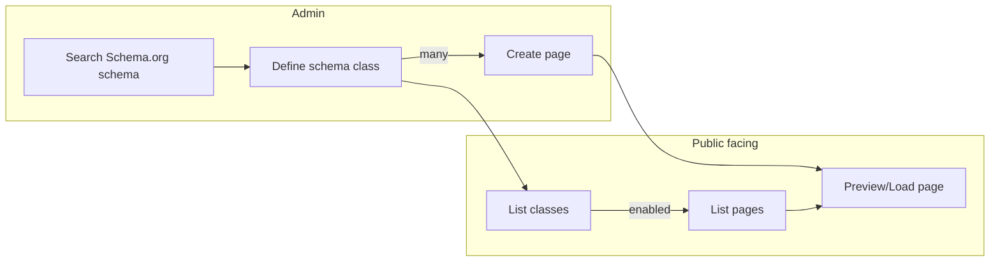

# Schema and page creation

## Schema and page creation flow

### Admin features

The Admin page runs on http://localhost:7080 and it provides features to manage schemas and pages of the CMS. This is the management application for the page editors.

#### Search Schema.org schema

The first step is to create schema, what will serve as a blueprint for pages. The searchbar allows to filter a dropdown list, where the Schema.org schemas are listed with their positions in the type hiearchy (breadcrumb).
Schema.org data is stored in a RDF (Resource Description Framework) triple format. The RDF database defines all the schemas, it's descriptions and properties in a graph. The `schemaorg` service loads the RDF database, and the `/pkg/rdf` package is responsible to fetch out data from the RDF database. 

#### Define schema class

Once the Schema.org schema is selected, the next step is to define the class. Here we define how a schema instance (class) will look like, what later will be a blueprint for creating pages.

See [feature/define-schema.md](feature/define-schema.md) for more details about schema definition feature.  
See [feature/define-schema.md#data-mapping](feature/define-schema.md#data-mapping) for schema definition data mapping details.

#### Create page

Once we have a class (page blueprint) we can create separate pages in the next step.
Here we can define specific values for the given page:
- HTML meta values
- field values of the properties
- enable or disable a page (in case we don't want to show them on the public facing page)
!! TODO: reference search, file upload, etc
Pages are listed in the Admin panel in a table with filtering and paging capabilities.

#### Preview page

When the page is under construction it is possible to preview how it will look like on the public facing page. Here the page data is gathered from the form and it is submitted as a POST form. This way it is possible to render and preview a page even if it's not saved at all, or disabled.

### Public facing features

The public facing page is for the page visitors who will see the final form of the webpage. This application runs in a different subprocess and reachable on http://localhost:8080.
The public facing page has a template with a header, footer, menu and search section, and they will be applied to all subpages.

#### List classes

The defined classes are dynamically listed in the menu. Whenever they are created and have any enabled page, it's name appears in the menu in alphabetical order.

#### List pages

When the class list is selected, a listing page is rendered, where the enabled pages are listed. This is a minimal list, which will load only the `listable` properties, and renders a listing tile for each page. This page also has a paging capability. Each page links to the detailed representation of itself.

#### Load page

When a page is loaded we check the URL for routing (see [Routing](#routing) for details) and if it is enabled, otherwise a 404 Not Found page is returned.
The page is rendered by reading the header meta values and the page data. The references are translated to links and the uploaded files are displayed as links or images.

#### Routing

When a page is requested, first we check the URL. There is a routing table where the SEO compatible URL slugs are stored. When an URL is found here, we check if it is the latest version. When we have a newer version, the page is redirect to the latest version with a 301 status. This is important, so old visitor links can still work even if the Admins are changing the URLS.
When the URL is not found in the routing table we try to load the page by matching the schema name and the identifier from the URL.
If there is no match, a 404 Not Found page is returned. 

---

## Schema and page data mapping

### Page

`page` SQL table:
- schema_name: Schema.org name of the schema
- identifier: TODO
- secondary_identifier: TODO
- listable_data: JSON map of the listable data built from the schema properties name and values set on the Admin page
- data: JSON map of the page data built from the schema properties name and values set on the Admin page
- meta: JSON map of HTML page meta fields used for SEO
- references: a JSON map of the page links, where the key is a counter e.g. {"ref0": "..", "ref1": ".."}
- enabled: page is enabled (this could be used to temprarily hide pages or not enable until it's under construction)

`page_search` SQL table:
- schema_name: Schema.org name of the schema
- identifier: identifier of the page
- col0 .. col4: property value mapped from searchable property at index 0 .. 4

`page.Page` domain:
- Route: TODO
- SchemaName: mapped from `page.name` DB table
- Identifier: TODO
- SecondaryIdentifier: TODO
- ListableData: mapped from `page.listable_data` DB table
- Data: mapped from `page.data` DB table
- Meta: mapped from `page.meta` DB table
- References: `page.PageMeta` mapped from `page.references` DB table
- IsEnabled: mapped from `page.enabled` DB table
- SearchVals: values of the searchable properties mapped from `page_search.col0`..`page_search.col4`

`page.PageMeta` domain:
- Title: TODO
- Description: TODO
- OGTitle: TODO
- OGDescription: TODO
- Rating: TODO
- Robots: TODO
- FieldMeta: TODO

`schema.SchemaMeta` domain:
- Name: mapped from `schema_meta.name` DB column
- Identifier: mapped from `schema_meta.identifier` DB column
- SecondaryIdentifier: mapped from `schema_meta.secondary_identifer` DB column
- Properties: mapped from `schema_meta_properties` DB table

`adminpage.pageDto` DTO:
- Route: TODO
- SchemaName: TODO
- Fields: TODO
- Identifier: TODO
- SecondaryIdentifier: TODO
- SecondaryIdentifierValue: TODO
- ListableData: TODO 
- References: TODO
- CreatedBy: TODO
- CreatedAt: TODO
- UpdatedBy: TODO
- UpdatedAt: TODO
- IsEnabled: TODO
- Meta: `adminpage.pageMeta` mapped from domain field

`adminpage.fieldDto` DTO:
- Name: TODO
- Order: TODO
- IsMandatory: TODO
- IsSearchable: TODO
- IsListable: TODO
- Type: TODO
- Component: TODO
- InputType: TODO
- Value: TODO

## Routing

TODO

TODO: explanations
- identifier, secondary identifier
- listable properties (why json)
- search fields, col0, col1...
- ref fields
- ref format #zhero#..

TODO: refactor field mapping to the following format
1. step: define page schema on route
short description:
link to steps/01-step-name

step-name:
description:
- template field:
    - purpose
    - special validation or processing logic
    - mapping:
        - sql field
        - domain field
        - dto field
...
