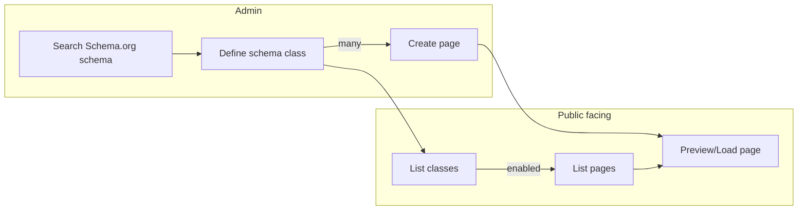

# Schema and page creation

## Schema and page creation flow

### Admin features

The Admin page runs on http://localhost:7080 and it provides features to manage schemas and pages of the CMS. This is the management application for the page editors.

#### Search Schema.org schema

The first step is to create schema, what will serve as a blueprint for pages. The searchbar allows to filter a dropdown list, where the Schema.org schemas are listed with their positions in the type hiearchy (breadcrumb).
Schema.org data is stored in a RDF (Resource Description Framework) triple format. The RDF database defines all the schemas, it's descriptions and properties in a graph. The `schemaorg` service loads the RDF database, and the `/pkg/rdf` package is responsible to fetch out data from the RDF database. 

#### Define schema class

Once the Schema.org schema is selected, the next step is to define the class. Here we define how a schema instance (class) will look like including the properties, what later will be a blueprint for creating pages.
Here we define the following terms:
- Schema name: the Schema.org name of the class type what will be used as a technical reference
- Identifier: a generated unique ID of a page
- Secondary Identifier: a human readable unique name, like the title of the page what would be used in URL slugs and search references

See [feature/define-schema.md](feature/define-schema.md) for more details about schema definition feature.  
See [feature/define-schema.md#data-mapping](feature/define-schema.md#data-mapping) for schema definition data mapping details.

Note: this is a combined feature where we can also update the defined schemas.

#### Create page

Once we have a class (page blueprint) we can create separate pages in the next step.
Here we can define specific values for the given page:
- HTML meta values
- field values of the properties
- enable or disable a page (in case we don't want to show them on the public facing page)

See [feature/create-page.md](feature/create-page.md) for more details about page creation feature.  
See [feature/create-page.md#data-mapping](feature/create-page.md#data-mapping) for page creation data mapping details.

Note: this is a combined feature where we can also update the created pages.

#### Preview page :WIP:

When the page is under construction it is possible to preview how it will look like on the public facing page. Here the page data is gathered from the form and it is submitted as a POST form. This way it is possible to render and preview a page even if it's not saved at all, or disabled.

### Public facing features :WIP:

The public facing page is for the page visitors who will see the final form of the webpage. This application runs in a different subprocess and reachable on http://localhost:8080.
The public facing page has a template with a header, footer, menu and search section, and they will be applied to all subpages.

#### List classes :WIP:

The defined classes are dynamically listed in the menu. Whenever they are created and have any enabled page, it's name appears in the menu in alphabetical order.

#### List pages :WIP:

When the class list is selected, a listing page is rendered, where the enabled pages are listed. This is a minimal list, which will load only the `listable` properties, and renders a listing tile for each page. This page also has a paging capability. Each page links to the detailed representation of itself.

#### Load page :WIP:

When a page is loaded we check the URL for routing (see [Routing](#routing) for details) and if it is enabled, otherwise a 404 Not Found page is returned.
The page is rendered by reading the header meta values and the page data. The references are translated to links and the uploaded files are displayed as links or images.

#### Routing

This feature is responsible to assign a page with a custom URL.

See [feature/routing.md](feature/routing.md) for more details about page routing feature.  

